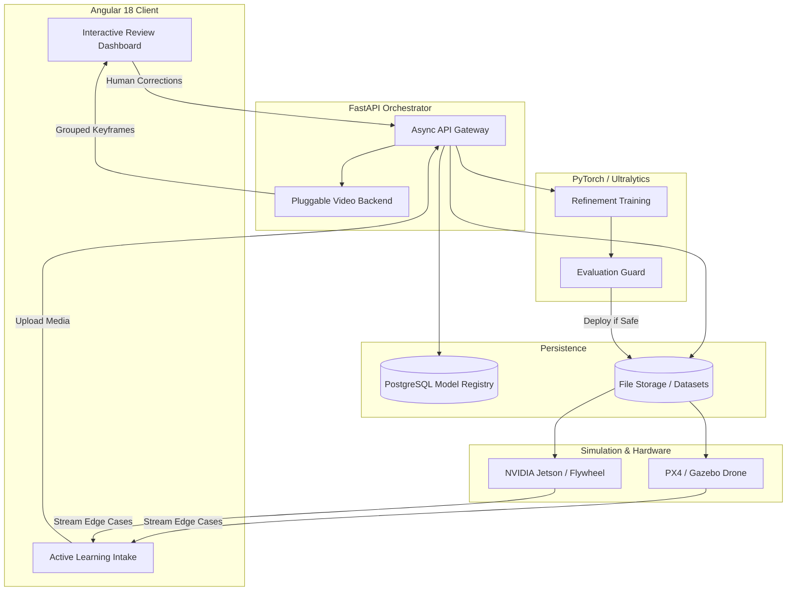

# 🚀 TrainFlowVision: Full-Stack Active Learning for Computer Vision

> **Note:** This is a public showcase repository. The production source code is private because the project contains custom ML workflow logic, training orchestration, and deployment architecture. Code access can be provided privately for serious technical review.

  

**TrainFlowVision** is an end-to-end MLOps and Active Learning platform designed to bridge the gap between raw data and production-ready edge AI models.

[Features](#-key-features) • [Architecture](#%EF%B8%8F-architecture--mlops-pipeline) • [Edge Deployment](#-edge-ai--tensorrt) • [Deep Dives](#-documentation-deep-dives)

---

## 💡 The Problem We Solve
Training a computer vision model (whether it's **YOLOv8**, **YOLO11**, **YOLO26**, or any custom architecture) is easy. Managing the messy lifecycle of data, however, is incredibly hard. 

Most models fail in production because they don't have a reliable feedback loop. **TrainFlowVision** solves this by providing a unified platform where you can:
1. **Intake Data:** Upload images, drone videos, or live streams using smart frame extraction (Auto, 0.5 FPS, 1 FPS).
2. **Quality-Gate Data:** Visually similar frames are automatically grouped together so humans only review *representative keyframes* via a lightning-fast Angular dashboard.
3. **Automatically Retrain:** Build pristine refinement datasets directly from human corrections and safely trigger active-learning model fine-tuning.
4. **Deploy & Guard:** New models must pass strict simulation (PX4 Gazebo) and real-world evaluation benchmarks before they are allowed to auto-promote to bare-metal edge devices (e.g., Jetson Orin NX).

Whether you are doing object detection, segmentation, or drone-based telemetry mapping, TrainFlowVision treats your **datasets and models like code**—versioned, tracked, and restorable.

---

## ✨ Key Features & Engineering Highlights

### 🛠️ Interactive Annotation & Review (Angular 18)
- **High-Performance HTML5 Canvas:** A custom-built, highly optimized annotation canvas using native 2D contexts to render thousands of bounding boxes and polygons without DOM lag.
- **Smart Active Learning Intake:** Eliminates "Review UI flooding" by probing video uploads, extracting frames using FFmpeg CUDA (or safe CPU fallbacks), and deduplicating visually similar frames so human engineers save time.
- **Human-in-the-Loop Workflow:** Fast, hotkey-driven UI driven by RxJS and modern Angular Signals for immutable state management. Correct false positives, fix missed detections, or resolve misclassifications directly.

### 🧠 Advanced MLOps & Experiment Tracking (FastAPI + PostgreSQL)
- **Asynchronous Orchestration:** FastAPI safely handles background PyTorch training threads utilizing `asyncio`, preventing long-running CUDA tasks from blocking the main API event loop.
- **Neural History & Safe Rollbacks:** Treats models like Git branches. Track metrics across every training run, and instantly revert to a previous model state if a new training epoch degrades detection quality.
- **Strict Evaluation Guards:** Models are blocked from auto-promotion if they fail real-world validation checks, ensuring a model that overfits to a simulation (Gazebo) never gets pushed to a real physical drone.
- **Strict Data Provenance:** PostgreSQL registry ties every `.pt` weight file to the exact human-reviewed dataset version and hyperparameter config used to train it, ensuring perfect auditability.

### 🚁 Edge AI & Robotics Simulation
- **Drone Simulation Loop (PX4 Gazebo SITL):** Fully integrated testing environment utilizing Gazebo Harmonic, PX4 SITL, and MAVSDK for closed-loop drone control, capturing downward camera feeds via GStreamer UDP.
- **Jetson TensorRT Acceleration:** Export PyTorch models into highly optimized `.engine` formats (FP16/INT8), running YOLO inference natively on NVIDIA Jetson Orin NX.
- **Closed-Loop Data Flywheel:** A non-blocking daemon evaluates bounding box confidence in real-time, buffering and streaming "edge-cases" (low confidence frames) back to the FastAPI backend over HTTP for human review.

---

## 🏗️ Architecture & MLOps Pipeline

TrainFlowVision is built on a strict microservice boundary, separating the reactive UI, the async orchestration API, the heavy PyTorch execution context, and the disconnected Edge devices/Simulation environments.

---

## 📸 Platform Screenshots

<b>1. Annotation Review Dashboard</b>

 

<b>2. Neural History, Metrics & Dashboard</b>

 

---

## 📚 Documentation Deep Dives

For a detailed look at the internal mechanics of the project, please explore the documentation:
- [Hiring Manager Brief](docs/HIRING_MANAGER_BRIEF.md)
- [Technical Deep Dive (Active Learning Loop)](docs/TECHNICAL_DEEP_DIVE.md)
- [Extended Features List](docs/FEATURES.md)
- [Architecture Details](docs/ARCHITECTURE.md)

---

## 🛣️ Roadmap & Future Vision

TrainFlowVision is continuously expanding to support enterprise-grade computer vision deployments and physical drone robotics.

- [x] **PyTorch to ONNX/TensorRT Pipeline** 
- [x] **Jetson Edge Client & TensorRT Integration** 
- [x] **Automated Edge Data Flywheel & Active Learning UI** 
- [x] **Video Frame Grouping & Pluggable Backend (FFmpeg CUDA/CPU)** 
- [x] **PX4 Gazebo SITL Drone Simulation (Closed-Loop Vision)** 
- [ ] **Live RTSP Video Stream Inference**
- [ ] **Live Field Testing on NVIDIA Jetson**
- [ ] **Autonomous Holybro X650 MAVLink Drone Integration**

---

## 👨‍💻 For Hiring Managers & Technical Recruiters

If you are evaluating my profile for a **Full-Stack**, **Machine Learning Engineer**, or **MLOps** role, this repository serves as a comprehensive portfolio of my engineering capabilities. It was built from the ground up to demonstrate production-ready software design across the entire stack:

- **End-to-End System Architecture:** Proves the ability to design, build, and deploy a complex, multi-tiered application (UI, REST API, Database, ML Engine, Edge Client, Robotics Simulator).
- **Frontend Mastery (Angular 18):** Demonstrates deep understanding of reactive programming (RxJS), modern state management (Signals), and high-performance DOM updates required for interactive HTML5 canvas rendering.
- **Backend & Async Orchestration (FastAPI):** Showcases ability to handle complex concurrency. The backend safely orchestrates background PyTorch training threads without blocking the main API event loop, ensuring the UI remains responsive under heavy GPU load.
- **Database Design & MLOps Safety (PostgreSQL):** Highlights relational database modeling. Every model weight file is tied directly to the exact dataset version, human corrections, and hyperparameter configuration used to train it. Built-in promotion guards block unsafe auto-promotions.
- **Applied AI & Edge Deployments:** Moves beyond basic "Jupyter Notebook data science" by implementing real-world MLOps patterns: active learning pipelines, neural history tracking, and compiling custom TensorRT `.engine` models for bare-metal NVIDIA Jetson Orin NX hardware.
- **Advanced Systems Engineering:** Demonstrates complex problem-solving by implementing visual hashing to deduplicate thousands of drone video frames to prevent flooding the Review UI, and seamlessly falling back between FFmpeg CUDA GPU processing and standard OpenCV CPU.

I build systems that solve real business problems—handling the messy reality of data collection, continuous human feedback, hardware-constrained deployments, and simulation safety.

---

<i>Engineered for the future of computer vision and edge AI.</i>

