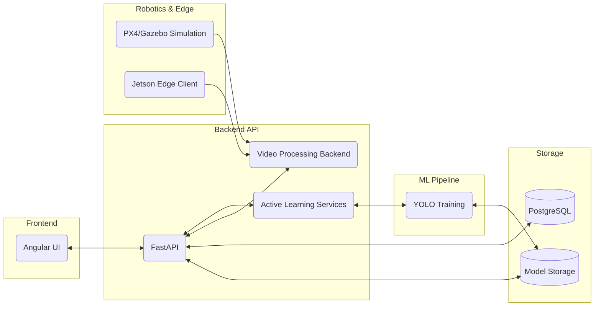

# TrainFlowVision

**An end-to-end computer vision MLOps platform for training, reviewing, refining, and safely deploying AI models across edge devices and drone simulations.**

## Overview

TrainFlowVision is a comprehensive engineering portfolio project that connects full-stack software development, Machine Learning Operations (MLOps), edge AI deployment, and robotics simulation into a single, cohesive workflow. 

It was built to solve a real-world engineering problem: **Machine learning models do not become useful after a single training run.** They must improve through continuous human-in-the-loop review, rigorous corrections, automated evaluation guards, and strict version control before they are ever safely deployed to a real drone or edge device.

---

## ⏱️ The 30-Second Summary

- **What it is:** A platform that ingests drone video feeds, extracts meaningful frames, allows humans to correct model mistakes, and automatically retrains and safely promotes the AI model.
- **Why it matters:** It demonstrates the ability to architect complex systems bridging UI/UX, robust backend pipelines, custom ML training loops, and robotics simulation.
- **The Tech Stack:** Angular, FastAPI, PostgreSQL, YOLO, PyTorch, FFmpeg/CUDA, PX4 Gazebo, and MAVSDK.

---

## 🛠️ What This Project Demonstrates

This project serves as a showcase of serious, professional software engineering capabilities:

- **Full-Stack Architecture:** Building a modern Angular frontend backed by a high-performance Python FastAPI server and relational PostgreSQL database.
- **ML Pipeline Ownership:** Taking full control of the ML lifecycle—training, custom dataset generation, inference, and rigorous evaluation.
- **MLOps & Safety:** Implementing model versioning, lineage tracking, safe rollback states, and strict auto-promotion guards that block models from deploying if they fail real-world benchmarks.
- **Active Learning at Scale:** Solving the "video frame explosion" problem by grouping visually similar frames, ensuring humans only review representative keyframes.
- **Edge AI & Robotics:** Designing a clear deployment path for NVIDIA Jetson devices and validating control logic using PX4 SITL and Gazebo Harmonic drone simulations.

---

## 🏗️ Architecture & Workflow

### The Active Learning Cycle

1. **Intake:** The system ingests images, video files, or live streams from the simulated drone or Jetson edge device.
2. **Smart Extraction:** A pluggable video backend (utilizing FFmpeg CUDA when available, with safe CPU fallbacks) extracts frames dynamically.
3. **Deduplication:** Visually similar frames are grouped together. 
4. **Human Review:** An engineer uses the Angular UI to review only the *representative keyframes*, correcting false positives, missed detections, or misclassifications.
5. **Refinement:** The backend constructs a pristine dataset exclusively from human-reviewed corrections and triggers a YOLO fine-tuning job.
6. **Promotion Guard:** The new model is evaluated against strict simulation and real-world benchmarks. If it performs worse, or lacks real-world validation data, it is blocked from auto-promotion.

---

## 📊 Project Status

We believe in technical honesty. Simulation flight is not equal to real drone flight, and hardware integration is treated with strict safety protocols.

✅ **Completed:**
- Angular frontend review workflow & FastAPI backend APIs.
- PostgreSQL metadata and ReviewCorrection persistence.
- YOLO model training, inference, and lineage tracking (Neural History).
- Pluggable video processing backend with smart frame extraction (Auto, 0.5 FPS, 1 FPS, 2 FPS).
- Similar frame grouping to prevent Review UI flooding.
- Human-reviewed refinement dataset builder and fine-tuning engine.
- Strict Evaluation and Promotion Guard preventing unsafe model deployment.
- PX4 Gazebo SITL simulation in WSL2 with downward camera feeds and MAVSDK control.

🔄 **In Progress:**
- High-altitude model detection improvements in simulation.
- Real-world validation image collection.
- Autonomous visual tracking logic.

📅 **Planned:**
- Live field testing on NVIDIA Jetson hardware.
- Physical integration with the Holybro X650 + Pixhawk 6X (tethered safety tests first).
- Real camera mount vibration validation and emergency geofence testing.

---

## ⚙️ Tech Stack

- **Frontend:** Angular, TypeScript, RxJS
- **Backend:** Python, FastAPI, SQLAlchemy, PostgreSQL
- **Machine Learning:** YOLO (Ultralytics), PyTorch, OpenCV
- **Video & Edge:** FFmpeg, GStreamer, CUDA/NVDEC, Jetson Orin NX, Docker
- **Robotics Simulation:** PX4 SITL, Gazebo Harmonic, MAVSDK

---

*Note: This repository is a public showcase. For the detailed engineering documentation, scripts, and full simulation playbooks, please refer to the primary technical repository.*
