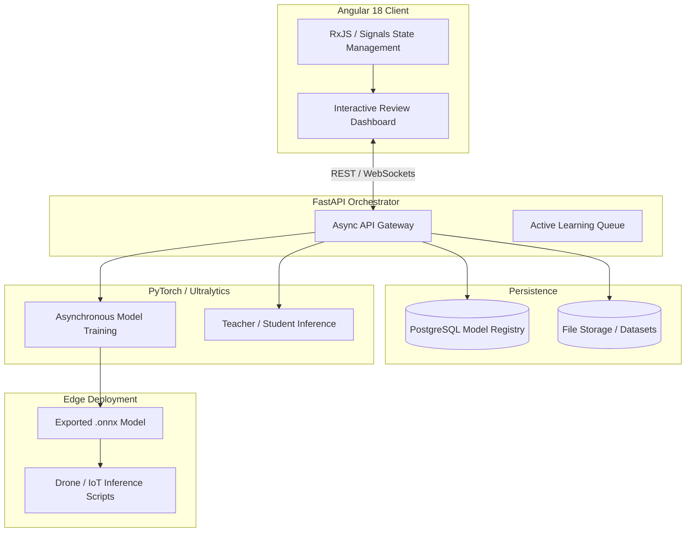

# 🚀 TrainFlowVision: Full-Stack Active Learning for Computer Vision

> **Note:** This is a public showcase repository. The production source code is private because the project contains custom ML workflow logic, training orchestration, and deployment architecture. Code access can be provided privately for serious technical review.

  

**TrainFlowVision** is an end-to-end MLOps and Active Learning platform designed to bridge the gap between raw data and production-ready edge AI models.

[Features](#-key-features) • [Architecture](#%EF%B8%8F-architecture--mlops-pipeline) • [Deep Dives](#-documentation-deep-dives) • [Roadmap](#-roadmap--future-vision)

---

## 💡 The Problem We Solve
Training a computer vision model (like **YOLOv8** or **YOLO26**) is easy. Managing the messy lifecycle of data, however, is incredibly hard. 

Most models fail in production because they don't have a reliable feedback loop. **TrainFlowVision** solves this by providing a unified platform where you can:
1. **Generate pseudo-labels** using heavy "Teacher" AI models.
2. **Quality-gate** the data through a lightning-fast, human-in-the-loop Angular dashboard.
3. **Automatically retrain** lightweight "Student" models.
4. **Deploy** optimized `.onnx` models directly to drones and edge devices.

Whether you are doing object detection, segmentation, or drone-based telemetry mapping, TrainFlowVision treats your **datasets and models like code**—versioned, tracked, and restorable.

---

## ✨ Key Features

### 🛠️ Interactive Annotation & Review
- **Human-in-the-Loop:** Fast, hotkey-driven canvas for bounding box and polygon editing with full Undo/Redo support.
- **Ensemble Review:** Compare predictions from multiple models side-by-side to catch false negatives.
- **Visual Confidence:** Clearly separates trusted human annotations from unverified machine predictions.

### 🧠 Advanced MLOps & Experiment Tracking
- **Neural History:** Treats models like Git branches. Track mAP, Precision, Recall, and Loss across every training run.
- **Model Registry:** PostgreSQL backed registry tying every weight file to the exact dataset version and hyperparameter config.
- **Safe Rollbacks:** Instantly revert to a previous model state if a new training epoch degrades detection quality.
- **Hardware-Aware:** Real-time CUDA/CPU utilization streaming and dynamic compute fallbacks.

### 🚁 Edge & Drone Ready
- **Jetson TensorRT Acceleration:** Export PyTorch models into highly optimized `.engine` formats, running YOLO inference natively on NVIDIA Jetson Orin NX at **80+ FPS**.
- **Data Flywheel (Active Learning):** An intelligent background daemon running on edge devices that seamlessly identifies edge cases (low-confidence frames) in real-time and uploads them directly to the backend for human review.
- **Geotag Metadata:** Native support for parsing drone telemetry JSON sidecars (GPS coordinates, altitude, pitch) alongside images for spatial dataset generation.
- **Hardware-Agnostic Fallback:** A decoupled `edge/` client utilizing pure Python and `opencv` to run inference seamlessly on non-NVIDIA devices like Raspberry Pi.

---

## 🏗️ Architecture & MLOps Pipeline

TrainFlowVision is built on a strict microservice boundary, separating the reactive UI, the async orchestration API, and the heavy PyTorch execution context.

---

## 📸 Platform Screenshots

<b>1. Annotation Review Dashboard</b>

 

<b>2. Neural History, Metrics & Dashboard</b>

 

---

## 📚 Documentation Deep Dives

For a detailed look at the internal mechanics of the project, please explore the documentation:
- [Hiring Manager Brief](docs/HIRING_MANAGER_BRIEF.md)
- [Technical Deep Dive (Active Learning Loop)](docs/TECHNICAL_DEEP_DIVE.md)
- [Extended Features List](docs/FEATURES.md)
- [Architecture Details](docs/ARCHITECTURE.md)

---

## 🛣️ Roadmap & Future Vision

TrainFlowVision is continuously expanding to support enterprise-grade computer vision deployments.

- [x] **PyTorch to ONNX Pipeline** (Completed)
- [x] **Geotagged Drone Metadata Support** (Completed)
- [x] **Jetson Edge Client & TensorRT Integration** (Completed)
- [x] **Automated Edge Data Flywheel** (Completed)
- [ ] **Live RTSP Video Stream Inference**
- [ ] **Autonomous MAVLink Drone Integration**
- [ ] **Cloud Provider Agnostic Workers (RunPod/AWS)**

---

## 👨‍💻 For Hiring Managers & Technical Recruiters

If you are evaluating my profile for a **Full-Stack**, **Machine Learning Engineer**, or **MLOps** role, this repository serves as a comprehensive portfolio of my engineering capabilities. It was built from the ground up to demonstrate production-ready software design:

- **End-to-End System Architecture:** Proves the ability to design, build, and deploy a complex, multi-tiered application (UI, REST API, Database, ML Engine, Edge Client).
- **Frontend Mastery (Angular 18):** Demonstrates deep understanding of reactive programming (RxJS), modern state management (Signals), and high-performance DOM updates required for interactive HTML5 canvas rendering (Bounding boxes & Polygons).
- **Backend & Async Orchestration (FastAPI):** Showcases ability to handle complex concurrency. The backend safely orchestrates background PyTorch training threads without blocking the main API event loop, ensuring the UI remains responsive under heavy GPU load.
- **Database Design (PostgreSQL):** Highlights relational database modeling. Every model weight file is tied directly to the exact dataset version and hyperparameter configuration used to train it, ensuring perfect auditability.
- **Applied AI & Edge Deployments:** Moves beyond basic "Jupyter Notebook data science" by implementing real-world MLOps patterns: Teacher-Student distillation, active learning pipelines, neural history tracking, and compiling custom TensorRT `.engine` models for bare-metal NVIDIA Jetson Orin NX hardware.
- **Closed-Loop Data Flywheel:** Demonstrates advanced systems programming by implementing a non-blocking queue on the edge client that evaluates confidence thresholds in real-time and streams edge-cases back to the FastAPI backend over HTTP.

I build systems that solve real business problems—handling the messy reality of data collection, continuous human feedback, and hardware-constrained deployments.

---

<i>Engineered for the future of computer vision and edge AI.</i>

