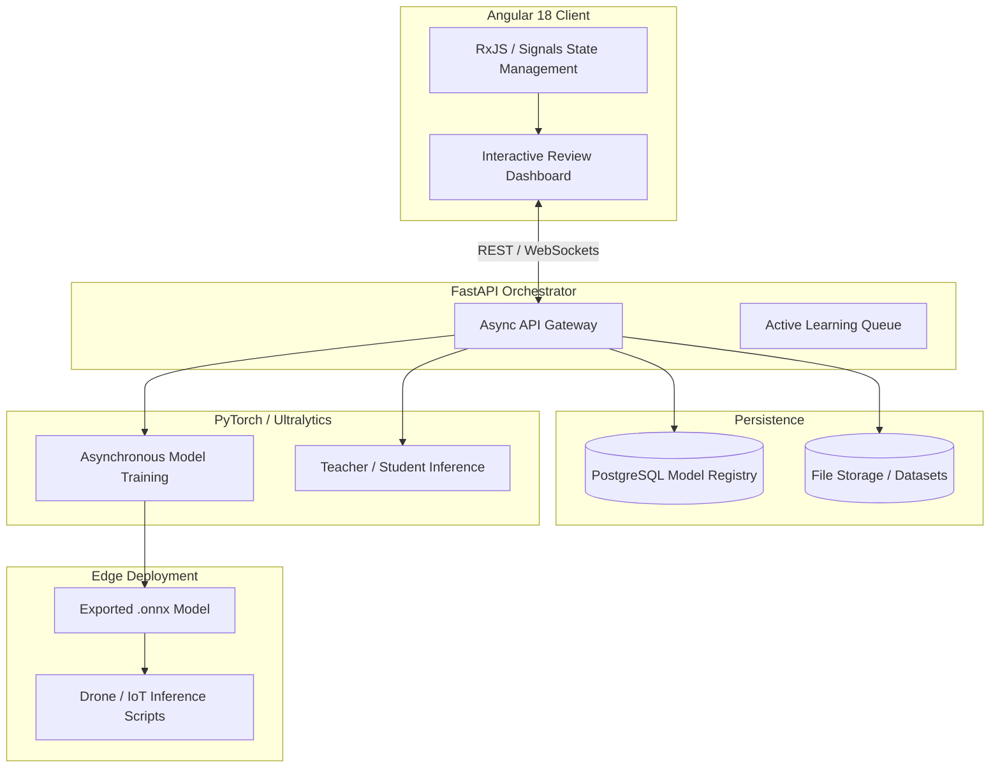

# 🚀 TrainFlowVision Showcase

> **Note:** This is a public showcase repository. The production source code is private because the project contains custom ML workflow logic, training orchestration, and deployment architecture. Code access can be provided privately for serious technical review.

## 💡 The Problem We Solve
Training a computer vision model is easy. Managing the messy lifecycle of data, however, is incredibly hard. 

Most models fail in production because they don't have a reliable feedback loop. **TrainFlowVision** solves this by providing a unified platform where you can:
1. **Generate pseudo-labels** using heavy "Teacher" AI models.
2. **Quality-gate** the data through a lightning-fast, human-in-the-loop Angular dashboard.
3. **Automatically retrain** lightweight "Student" models.
4. **Deploy** optimized `.onnx` models directly to drones and edge devices.

Whether you are doing object detection, segmentation, or drone-based telemetry mapping, TrainFlowVision treats your **datasets and models like code**—versioned, tracked, and restorable.

## 🏗️ Architecture
TrainFlowVision is built on a strict microservice boundary, separating the reactive UI, the async orchestration API, and the heavy PyTorch execution context.

## 📸 Platform Screenshots
*(Please see the `screenshots/` directory for actual snapshots of the UI, or check the docs below)*
1. **Annotation Review Dashboard**
2. **Neural History, Metrics & Dashboard**

## 👨‍💻 For Hiring Managers & Technical Recruiters
If you are evaluating my profile for a **Full-Stack**, **Machine Learning Engineer**, or **MLOps** role, this repository serves as a comprehensive portfolio of my engineering capabilities. It was built from the ground up to demonstrate production-ready software design.

I build systems that solve real business problems—handling the messy reality of data collection, continuous human feedback, and hardware-constrained deployments.

**Deep Dives:**
- [Hiring Manager Brief](docs/HIRING_MANAGER_BRIEF.md)
- [Technical Deep Dive](docs/TECHNICAL_DEEP_DIVE.md)
- [Features Overview](docs/FEATURES.md)
- [Architecture Details](docs/ARCHITECTURE.md)
- [Roadmap](docs/ROADMAP.md)
