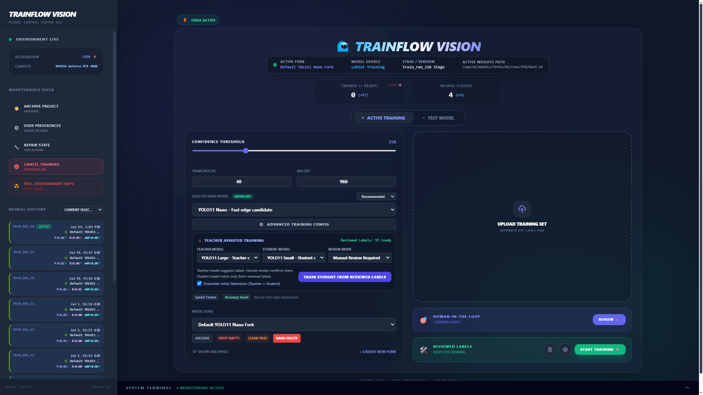
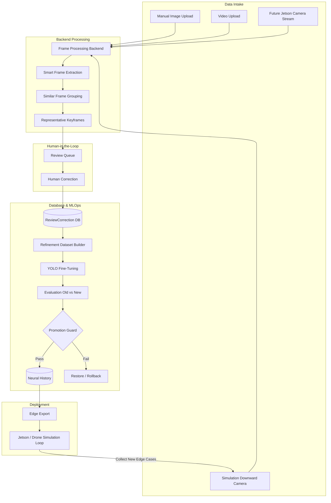
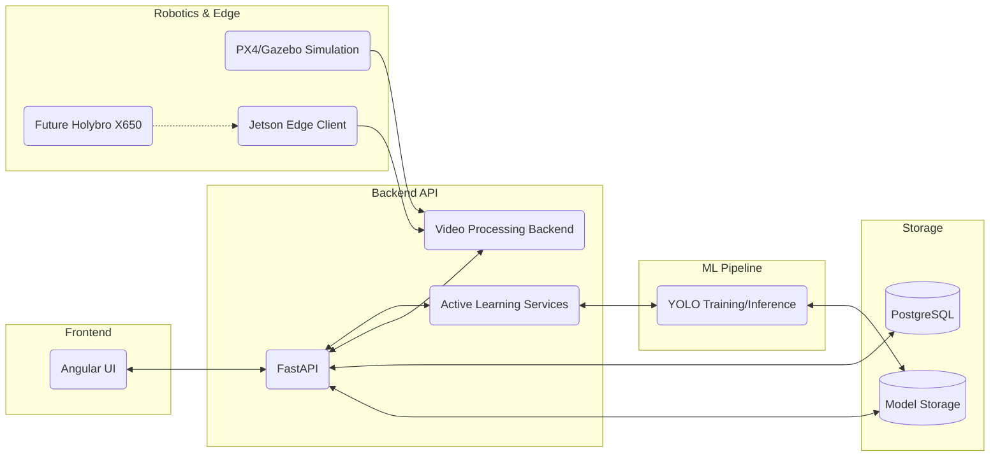
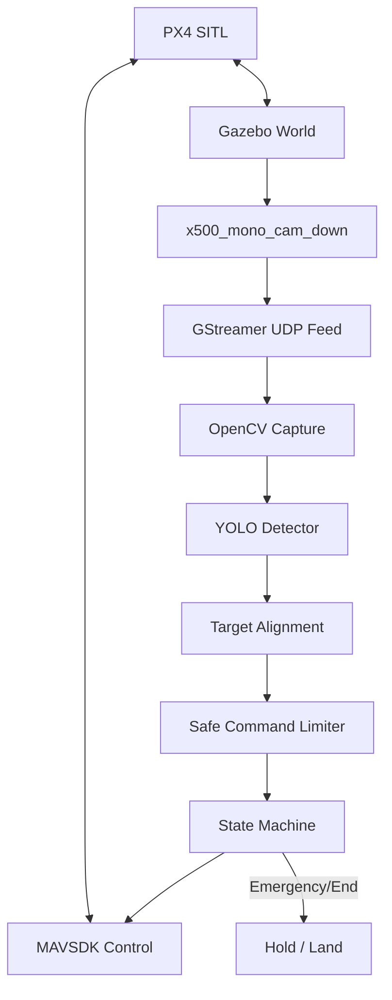
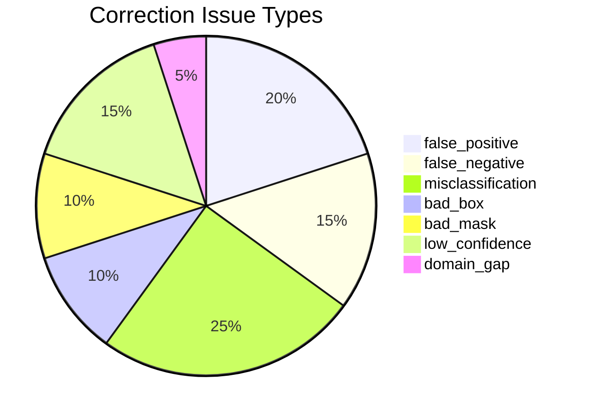

# 🚀 TrainFlowVision: Full-Stack Active Learning for Computer Vision

> **Note:** This is a public showcase repository. The production source code is private because the project contains custom ML workflow logic, training orchestration, and deployment architecture. Code access can be provided privately for serious technical review.

  

**TrainFlowVision is an end-to-end computer vision MLOps platform for training, reviewing, refining, versioning, and safely deploying YOLO models across desktop, edge devices, and drone simulation.**

[Features](#-key-features) • [Architecture](#%EF%B8%8F-architecture--mlops-pipeline) • [Edge Deployment](#-edge-ai--tensorrt) • [Deep Dives](#-documentation-deep-dives)

---

## ⏱️ The 30-Second Summary

- **What it is:** A platform that ingests drone video feeds, extracts meaningful frames, allows humans to correct model mistakes, and automatically retrains and safely promotes the AI model.
- **Why it matters:** It demonstrates the ability to architect complex systems bridging UI/UX, robust backend pipelines, custom ML training loops, and robotics simulation.
- **The Tech Stack:** Angular, FastAPI, PostgreSQL, YOLO, PyTorch, FFmpeg/CUDA, PX4 Gazebo, and MAVSDK.

---

## 💡 The Problem We Solve
Training a computer vision model is easy. Managing the messy lifecycle of data, however, is incredibly hard. 

Most models fail in production because they don't have a reliable feedback loop. **TrainFlowVision** connects full-stack software, machine learning operations, edge AI deployment, and robotics simulation into one cohesive workflow. Models improve through continuous human-in-the-loop review, rigorous corrections, automated evaluation, strict versioning, and safe deployment.

---

## 📸 Platform Screenshots

<b>1. Annotation Review Dashboard</b>

 

<b>2. Neural History, Metrics & Dashboard</b>

 

---

## 1. End-to-End Active Learning Pipeline

---

## 2. Architecture Diagram

---

## 3. Drone Simulation Workflow

---

## 4. Review Issue Types

The issue type defines *what* mistake the model made. Geometry types dynamically adapt to the active model task (`detect` = bbox, `segment` = polygon, `obb` = rotated box).

*(Note: If the model predicts "Sunflower" in Gazebo, it doesn't mean a sunflower exists in the virtual world. It means the drone's dandelion marker is being misclassified due to a domain gap. This is exactly what the active-learning cycle solves.)*

---

## 5. Active Learning Intake

A raw drone video can contain thousands of near-identical frames. TrainFlowVision is designed so that humans **never review redundant frames**. 

Instead, the pipeline:
1. Probes the video file.
2. Uses smart frame extraction (Auto, 0.5 FPS, 1 FPS, 2 FPS).
3. Groups visually similar frames via hashing and IoU overlap.
4. Selects a single **representative keyframe** per group.
5. Lets the human correct only the keyframes.
6. Preserves the represented frame count to retain data weight.
7. Builds a clean refinement dataset explicitly from human-reviewed or safely propagated corrections.

**Example Intake Summary:**
> **Video Uploaded:** `garden_flight.mp4`  
> **Total Frames:** `4,800`  
> **Extracted Frames:** `320`  
> **Grouped Similar Frames:** `296`  
> **Review Keyframes:** `24`  
> **Human Review Saved:** `4,776 frames avoided`  
> **Processing Backend:** `FFmpeg CUDA (if available), otherwise CPU fallback`

---

## 6. Fine-Tuning and Promotion Guard

A model is never blindly auto-promoted simply because it performed well in a synthetic simulation. It must pass strict evaluation checks:
- Simulated marker-hover frames at various altitudes (5m, 4m, 3m, 2m, 1.5m).
- **Real-world dandelion validation images** (when available).
- Sunflower/Dandelion confusion edge cases.

**If real-world validation data is missing:**
- The training pipeline is permitted to run.
- Simulation evaluation metrics are saved.
- **Auto-promotion is blocked.**
- The `promotion_status` is explicitly set to `needs_real_world_validation`.

This enforces safety by ensuring models do not dangerously overfit to Gazebo graphics before flying on a real drone.

---

## 7. Project Status

We believe in technical honesty. Simulation flight is not equal to real drone flight, and hardware integration is treated with strict safety protocols.

✅ **Completed:**
- Angular frontend review workflow & FastAPI backend APIs.
- PostgreSQL metadata and ReviewCorrection persistence.
- YOLO model training, inference, and lineage tracking (Neural History).
- Pluggable video processing backend with smart frame extraction (Auto, 0.5 FPS, 1 FPS, 2 FPS).
- Similar frame grouping to prevent Review UI flooding.
- Human-reviewed refinement dataset builder and fine-tuning engine.
- Strict Evaluation and Promotion Guard preventing unsafe model deployment.
- PX4 Gazebo SITL simulation in WSL2 with downward camera feeds and MAVSDK control.

🔄 **In Progress:**
- High-altitude model detection improvements in simulation.
- Real-world validation image collection.
- Autonomous visual tracking logic.

📅 **Planned:**
- Live field testing on NVIDIA Jetson hardware.
- Physical integration with the Holybro X650 + Pixhawk 6X (tethered safety tests first).
- Real camera mount vibration validation and emergency geofence testing.

---

## 8. Safety and Honesty

- **Simulation != Reality**: Simulation flight is not equal to real drone flight.
- **Physical Safety First**: Real drone work requires tested manual overrides, strict geofencing, emergency stop integration, physical vibration testing, and Pixhawk safety validation.
- **Edge Inference**: The Jetson should run inference and upload learning frames. Heavy GPU training runs on a desktop/server, *not* on the drone during flight.
- **Live Learning Scope**: Near-live active learning is supported through frame upload and review. The drone can send low-confidence or confusing frames back to the backend. Human review and retraining happen safely offboard. The refined model is then versioned and exported back to the Jetson.

---

## 👨‍💻 For Hiring Managers & Technical Recruiters

If you are evaluating my profile for a **Full-Stack**, **Machine Learning Engineer**, or **MLOps** role, this repository serves as a comprehensive portfolio of my engineering capabilities. It was built from the ground up to demonstrate production-ready software design across the entire stack:

- **End-to-End System Architecture:** Proves the ability to design, build, and deploy a complex, multi-tiered application (UI, REST API, Database, ML Engine, Edge Client, Robotics Simulator).
- **Frontend Mastery (Angular 18):** Demonstrates deep understanding of reactive programming (RxJS), modern state management (Signals), and high-performance DOM updates required for interactive HTML5 canvas rendering.
- **Backend & Async Orchestration (FastAPI):** Showcases ability to handle complex concurrency. The backend safely orchestrates background PyTorch training threads without blocking the main API event loop, ensuring the UI remains responsive under heavy GPU load.
- **Database Design & MLOps Safety (PostgreSQL):** Highlights relational database modeling. Every model weight file is tied directly to the exact dataset version, human corrections, and hyperparameter configuration used to train it. Built-in promotion guards block unsafe auto-promotions.
- **Applied AI & Edge Deployments:** Moves beyond basic "Jupyter Notebook data science" by implementing real-world MLOps patterns: active learning pipelines, neural history tracking, and compiling custom TensorRT `.engine` models for bare-metal NVIDIA Jetson Orin NX hardware.
- **Advanced Systems Engineering:** Demonstrates complex problem-solving by implementing visual hashing to deduplicate thousands of drone video frames to prevent flooding the Review UI, and seamlessly falling back between FFmpeg CUDA GPU processing and standard OpenCV CPU.

I build systems that solve real business problems—handling the messy reality of data collection, continuous human feedback, hardware-constrained deployments, and simulation safety.

---

<i>Engineered for the future of computer vision and edge AI.</i>

