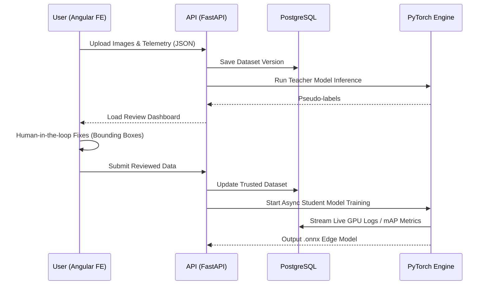

# 🏗️ Architecture & MLOps Pipeline

TrainFlowVision is designed as a modular full-stack ML platform, not just a single training script. The architecture separates Frontend, Backend, database, ML orchestration, dataset management, model history, and future deployment concerns.

## Data Flow

## Microservice Boundaries
- **Frontend (Angular 18)**: Manages state using RxJS and Signals. Handles complex HTML5 canvas rendering for interactive bounding box/polygon editing.
- **Backend (FastAPI)**: Safely orchestrates background PyTorch training threads without blocking the main API event loop. 
- **Database (PostgreSQL)**: Complex SQLAlchemy schemas govern the relationship between uploaded data, human reviews, training configurations, and emitted weights. Ensures relational integrity and auditability.
- **Edge Deployment (Standalone)**: A completely decoupled `edge/` client utilizing pure `onnxruntime` and `numpy`.
